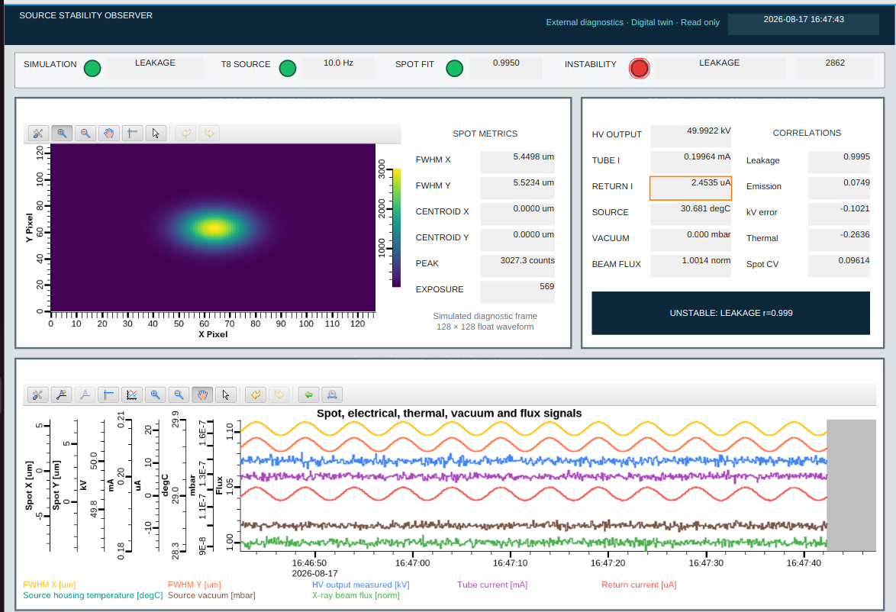
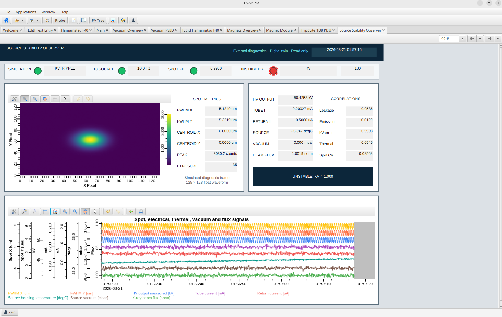

# Source Stability Diagnostic Observer

This repository presents a read-only diagnostic architecture for investigating
inconsistent X-ray spot metrics. It is a tested engineering demonstrator with a
clear boundary between simulated verification and deployment on physical equipment.

The project combines a hardened portable C observer, a C exposure synchronizer,
a defensive LabJack T8/LJM acquisition boundary, an EPICS PV contract, a Phoebus
operator display, and deterministic Python verification stimulus.

The observer asks a deliberately limited question:

> When the measured X-ray spot becomes unstable, which synchronized electrical,
> thermal, vacuum, or flux measurement is most strongly associated with it?

It reports **associations, not causation**. A controlled intervention or repeatable
fault-removal test would still be required before identifying a root cause.

<p align="center">
  
</p>

**Figure 1. Deterministic leakage scenario in the EPICS/Phoebus interface.**
The fitted X-ray spot image appears at upper left; exposure-aligned spot metrics,
conditioned diagnostics, and Pearson associations appear at upper right; and the
eight independently scaled, color-coded traces appear below. The observer reports
`UNSTABLE: LEAKAGE` because the spot-width variation is strongly associated with
the simulated return/ground-current signal. This figure shows verification
stimulus, not measurements from an operating machine.

## Demonstrated data path

1. Conditioned, low-voltage diagnostics represent HV output, tube current,
   return current, filament current, source temperature, vacuum, and beam flux.
2. The proposed T8 interface acquires eight hardware-timed analog channels.
3. The C exposure synchronizer selects T8 scans inside each detector exposure
   window and retains the exposure ID.
4. The C quality gate rejects incomplete timing, non-finite values, and poor spot fits.
5. A bounded 64-exposure window calculates spot coefficient of variation and
   numerically stable Pearson associations.
6. EPICS publishes raw measurements, quality state, results, and diagnostic flags
   for Phoebus visualization and later archiving.

See [Deployment boundary](docs/DEPLOYMENT_BOUNDARY.md) for the exact boundary
between the demonstrated implementation and deployment on physical equipment.

## Demonstration modes

Run any mode with:

```bash
./scripts/start_demo.sh MODE
```

| Mode | Injected verification condition | Expected observer behavior | What to examine in Phoebus |
|---|---|---|---|
| `normal` | Nominal values plus small independent noise | Stable spot; no association threshold | Narrow spot traces and low CV |
| `leakage` | Slow return/ground-current variation coupled to X/Y spot width | `UNSTABLE: LEAKAGE` | Return-current and spot traces rise and fall together |
| `emission` | Tube-current oscillation with flux and horizontal spot response | `UNSTABLE: EMISSION` | Tube current, flux, and Spot X share the fast oscillation |
| `kv-ripple` | Accelerating-voltage ripple coupled to both spot axes | `UNSTABLE: KV` | HV output and spot traces show matching ripple |
| `thermal` | Source-housing temperature drift/oscillation coupled to spot width | `UNSTABLE: THERMAL` | Temperature and both spot axes co-vary slowly |
| `cable` | Periodic return-current step, tube-current reduction, flux loss, and spot excursion | Intermittent instability with competing associations | Abrupt, repeating multi-signal excursions |
| `optical` | Spot width and centroid move without a matching monitored electrical variable | `UNSTABLE: OPTICAL_MECH` | Spot changes while electrical diagnostics remain comparatively quiet |
| `bad-image` | Distorted/saturated image with fit quality below the acceptance threshold | `REJECTED: input quality gate` | Invalid fit; rejected count increases; sample never enters the observer window |

### Example: kV-ripple mode

```bash
./scripts/start_demo.sh kv-ripple
```

<p align="center">
  
</p>

**Figure 2. Deterministic accelerating-voltage-ripple scenario.** The live strip
chart shows matching periodic structure in measured HV output and both spot-width
metrics. The C observer reports a kV-error association of approximately `r = 1.0`,
while the competing leakage, emission, and thermal associations remain small.

As with Figure 1, this is deterministic verification stimulus designed to test
classification—not evidence from an operating machine.

## Ubuntu quick start

```bash
git clone https://github.com/Rainer1370/source-stability-observer.git
cd source-stability-observer

# Inspect requirements without changing the machine:
./scripts/check_dependencies.sh

# Install available Ubuntu prerequisites, create .venv, build, and test:
./scripts/setup_ubuntu.sh --install

# Start the recommended demonstration:
./scripts/start_demo.sh leakage
```

The launcher builds and tests the C components, starts `softIoc` in server mode,
waits for the IOC heartbeat, and then runs the selected stimulus. Press Ctrl+C to
stop the simulator and IOC cleanly.

If Phoebus is already open, the display reconnects automatically. To launch it:

```bash
START_PHOEBUS=1 ./scripts/start_demo.sh leakage
```

For another installation:

```bash
PHOEBUS_CMD=/absolute/path/to/phoebus.sh \
START_PHOEBUS=1 \
./scripts/start_demo.sh leakage
```

While the demonstration is running, check the public PV contract with:

```bash
./scripts/smoke_test.sh
```

Detailed installation instructions are in
[Installation](docs/INSTALLATION.md).

## Build and test the portable C components

```bash
make all test
make sanitize
```

The test suite covers nominal and injected signatures, quality-gate exclusion,
non-finite input rejection, configuration validation, T8 adapter contracts, and
exposure synchronization.

## Implementation map

- [Portable observer](src/observer.c) — spot metric, quality gate, rolling CV,
  Pearson associations, and diagnostic flags.
- [Exposure synchronizer](src/exposure_sync.c) — bounded T8 scan history,
  exposure-window selection, coverage/gap checks, averaging, and ID propagation.
- [LabJack T8 acquisition adapter](src/input_labjack_t8.c) — validated Ethernet/LJM
  stream lifecycle and buffer contract.
- [EPICS database](ioc/SourceObserverApp/Db/sourceObserver.db) — public PV names,
  units, alarms, heartbeat, observer results, and image waveform.
- [Deterministic live stimulus](python/simulate_epics.py) — simulation and EPICS
  publication for this hardware-independent demonstration.
- [Phoebus display](phoebus/Source_Stability_Observer.bob) — synchronized spot image,
  measurements, correlations, status, and independently scaled live traces.

Python supplies deterministic inputs for the current demonstration. The bespoke
analytics, quality gate, acquisition boundary, and exposure-alignment logic are C.
The future EPICS `asynPortDriver` wrapper would be C++ because that EPICS interface
is class-based.

## Documentation

- [System overview](docs/SYSTEM_OVERVIEW.md) — measurement architecture, terminology, and verification plan.
- [Algorithm notes](docs/ALGORITHM.md) — source map and decision-core explanation.
- [Deployment boundary](docs/DEPLOYMENT_BOUNDARY.md) — implemented functionality and remaining integration work.
- [Installation](docs/INSTALLATION.md) — Ubuntu setup, operation, and smoke tests.
- [EPICS IOC notes](ioc/README.md) — IOC build and launch options.
- [Phoebus PV bindings](phoebus/PV_BINDINGS.md) — display-to-PV mapping.
- [Alarm rationale](ioc/ALARMS.md) — illustrative alarm limits and intended use.

## Safety and scope

This is an independently developed engineering demonstrator using synthetic data
and illustrative thresholds. It observes conditioned low-voltage signals,
does not command high voltage, and is not part of a protection or interlock chain.

Before physical deployment, the channel ranges, isolation, calibration, common
timebase, detector integration, reconnection behavior, backlog handling, and
long-duration reliability must be validated. See
[Deployment boundary](docs/DEPLOYMENT_BOUNDARY.md).

## Copyright

Copyright © 2026 Robert Rainer. All rights reserved.

This repository is available for technical review and evaluation only. No right
to copy, modify, distribute, sublicense, sell, publish, incorporate into another
work, or use commercially or operationally is granted without prior written
authorization. See the [license](LICENSE).
